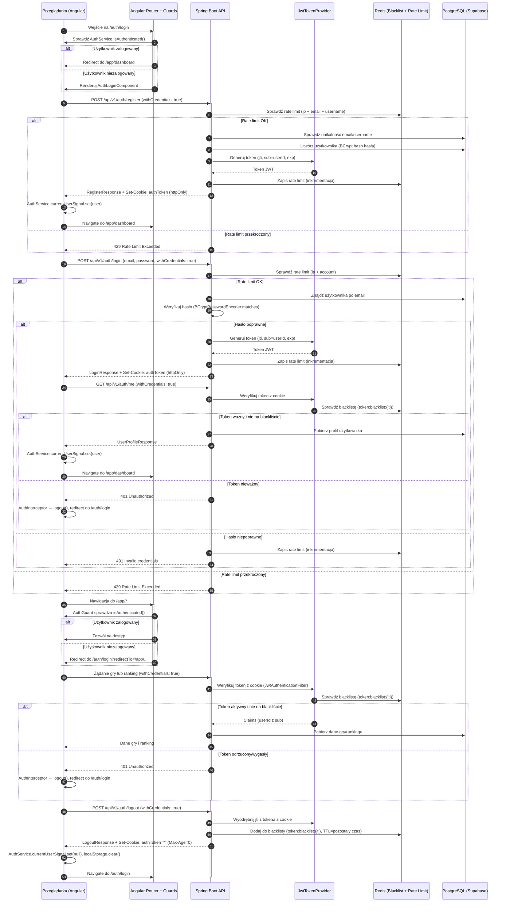

<authentication_analysis>
1. Przepływy autentykacji z PRD i specyfikacji:
   - Logowanie istniejącego użytkownika (AuthLoginComponent, POST /api/v1/auth/login,
     rate limit 5/15min per IP i per account, JWT w httpOnly cookie, zapis w AuthService,
     redirect do /app).
   - Rejestracja + auto-login (AuthRegisterComponent, POST /api/v1/auth/register,
     automatyczne cookie i przejście do dashboard).
   - Gość przechodzi do rejestracji (GuestStartButton → RegisterDialog →
     konsolidacja stanu gry z kontem - przyszła funkcjonalność).
   - Weryfikacja tokena (AuthGuard, GET /api/v1/auth/me, automatyczne wylogowanie przy 401).
   - Wylogowanie globalne (POST /api/v1/auth/logout, blacklist w Redis, czyszczenie AuthService).
2. Główni aktorzy i interakcje:
   - Przeglądarka/Angular: renderuje komponenty (AuthLoginComponent, AuthRegisterComponent),
     wysyła formularze, przechowuje stan w AuthService (signals).
   - Angular Router + Guards: sprawdza autentykację przed trasami, przekierowuje do /auth/login.
   - Spring Boot API (AuthController): obsługuje /api/v1/auth/*, używa Spring Security JWT.
   - JwtTokenProvider + TokenBlacklistService: generuje i weryfikuje JWT, zarządza blacklistą w Redis.
   - Redis: przechowuje blacklistę tokenów (token:blacklist:{tokenId}) i rate limitery.
   - PostgreSQL (Supabase): przechowuje użytkowników (tabela users), hasła hashowane BCrypt.
3. Procesy weryfikacji i odświeżania tokenów:
   - Token JWT (domyślnie 3600s/1h) przechowywany w httpOnly cookie `authToken`.
   - JwtAuthenticationFilter (Spring Security) weryfikuje token z cookie i blacklistę przed każdym żądaniem.
   - W przypadku nieprawidłowego/wygasłego tokena zwraca 401, co powoduje automatyczne wylogowanie przez AuthInterceptor.
   - AuthInterceptor przechwytuje 401/403, wywołuje logout() i czyści stan użytkownika.
4. Kroki autentykacji (skrót):
   a) Wejście na stronę auth → AuthGuard sprawdza isAuthenticated(), przekierowuje jeśli zalogowany.
   b) Formularz logowania/rejestracji waliduje dane i wysyła POST do /api/v1/auth/login|register z withCredentials: true.
   c) Backend sprawdza rate limit, weryfikuje dane, generuje JWT przez JwtTokenProvider, ustawia httpOnly cookie.
   d) AuthService wypełnia currentUserSignal, Router przenosi do /app, AuthGuard pilnuje stanu przy kolejnych trasach.
   e) Przy każdym żądaniu JwtAuthenticationFilter weryfikuje token z cookie i blacklistę; przy 401 AuthInterceptor wylogowuje.
   f) Wylogowanie dodaje token na blacklistę w Redis i usuwa cookie, frontend czyści AuthService i localStorage.
</authentication_analysis>

<mermaid_diagram>

</mermaid_diagram>

