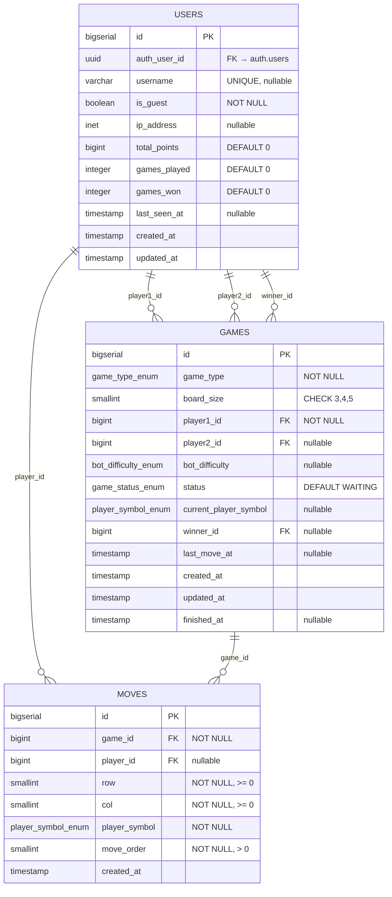

# 🎯 Schemat bazy danych TBS - Szybki podgląd

## Główne tabele i relacje

### ASCII Diagram

```
┌─────────────────────────────────────────────────────────────────────┐
│                    TBS DATABASE SCHEMA                              │
└─────────────────────────────────────────────────────────────────────┘

┌──────────────────────┐         ┌──────────────────────┐
│      USERS           │         │       GAMES          │
├──────────────────────┤         ├──────────────────────┤
│ PK id                │◄────┐   │ PK id                │◄───┐
│    auth_user_id      │     │   │    game_type         │    │
│    username          │     │   │    board_size        │    │
│    is_guest          │     │   │    status            │    │
│    ip_address        │     │   │    bot_difficulty    │    │
│    total_points      │     │   │    current_player_symbol │
│    games_played      │     │   │    winner_id         │    │
│    games_won         │     │   │    last_move_at      │    │
│    last_seen_at      │     └───┤ FK player1_id        │    │
│    created_at        │         │ FK player2_id        │    │
│    updated_at        │         │ FK winner_id         │    │
└──────────────────────┘         │    created_at        │    │
                                 │    updated_at        │    │
                                 │    finished_at       │    │
                                 └──────────────────────┘    │
                                          │                   │
                                          │                   │
                                 ┌────────┴────────────┐      │
                                 │      MOVES          │      │
                                 ├─────────────────────┤      │
                                 │ PK id               │      │
                                 │ FK game_id ─────────┘      │
                                 │ FK player_id ──────────────┘
                                 │    row                   │
                                 │    col                   │
                                 │    player_symbol        │
                                 │    move_order           │
                                 │    created_at           │
                                 └─────────────────────────┘

📝 Uwaga: email i password_hash są w Supabase Auth (auth.users)
```

### Mermaid ERD (interaktywny)

> **Tip**: W GitHubie, VS Code i innych edytorach z obsługą Mermaid ten diagram będzie renderowany jako interaktywna wizualizacja!



## Relacje

### USERS ↔ GAMES
- **USERS 1:N GAMES** (player1_id, player2_id, winner_id)
- Użytkownik może być graczem 1 lub 2 w wielu grach
- Użytkownik może wygrać wiele gier

### USERS ↔ MOVES
- **USERS 1:N MOVES** (player_id)
- Użytkownik wykonuje wiele ruchów
- Boty: `player_id = NULL`

### GAMES ↔ MOVES
- **GAMES 1:N MOVES** (game_id)
- Gra zawiera wiele ruchów
- Stan planszy generowany z historii ruchów

## Typy gier

### vs_bot
- `player2_id = NULL`
- `bot_difficulty = easy | medium | hard`
- Punkty: 100 / 500 / 1000

### pvp
- `player2_id = NOT NULL`
- `bot_difficulty = NULL`
- Punkty: 1000
- Timeout: 20 sekund nieaktywności

## Automatyzacje

### Triggery
- **`update_users_updated_at`**: Automatyczna aktualizacja `updated_at` w `users`
- **`update_games_updated_at`**: Automatyczna aktualizacja `updated_at` w `games`
- **`update_game_last_move_timestamp`**: Aktualizacja `last_move_at` przy każdym ruchu
- **`update_user_stats_on_game_finished`**: Aktualizacja statystyk przy zakończeniu gry

### Funkcje pomocnicze
- **`generate_board_state(p_game_id)`**: Generuje stan planszy z historii ruchów
- **`is_move_valid(p_game_id, p_row, p_col)`**: Walidacja poprawności ruchu
- **`calculate_game_points(p_game_type, p_bot_difficulty)`**: Oblicza punkty za wygraną
- **`get_user_ranking_position(p_user_id)`**: Zwraca pozycję w rankingu
- **`refresh_player_rankings()`**: Odświeża materialized view rankingu

### Automatyzacje punktów i timeout

#### System punktowy
Po zakończeniu gry (`status = finished`):
- ✅ Zwiększa `games_played` dla uczestników
- ✅ Zwiększa `games_won` dla zwycięzcy
- ✅ Dodaje punkty `total_points` zgodnie z systemem punktowym

#### Timeout pvp
Funkcja **`check_pvp_timeout()`** wywoływana okresowo (np. Spring Scheduled):
- Sprawdza gry pvp z brakiem aktywności > 20s
- Automatycznie ustawia zwycięzcę (przeciwnik timeout'ującego)
- Kończy grę jako `finished`

## Punkty za wygraną

| Typ gry      | Poziom trudności | Punkty |
|--------------|------------------|--------|
| vs_bot       | easy             | 100    |
| vs_bot       | medium           | 500    |
| vs_bot       | hard             | 1000   |
| pvp          | -                | 1000   |

## Widoki

### Materialized View: `player_rankings`
Ranking graczy (tylko zarejestrowani):

```sql
player_rankings
├─ rank_position (ROW_NUMBER)
├─ username
├─ total_points
├─ games_played
└─ games_won
```

Odświeżane przez `refresh_player_rankings()` (zadanie w tle)

### View: `game_summary`
Podsumowanie gier z informacjami o graczach:
- Dane gry (typ, status, rozmiar planszy)
- Informacje o graczach (nazwy, czy są gośćmi)
- Zwycięzca i liczba ruchów

---

## Integracja z Supabase Auth

### Relacja auth.users ↔ users

**1:1** — jeden użytkownik w Supabase Auth ma jeden profil w tabeli `users`

```
auth.users (Supabase Auth)          users (profil)
├─ id (UUID) ◄──────────────────► auth_user_id
├─ email
├─ encrypted_password
└─ created_at                   ├─ username
                                ├─ total_points
                                ├─ games_played
                                └─ games_won
```

### Zarządzanie użytkownikami

- **Zarejestrowani**: email, hasło w `auth.users`; profil, statystyki w `users`
- **Goście**: tylko `users`, bez `auth_user_id`

### Bezpieczeństwo

- Autentykacja przez Supabase Auth
- `auth_user_id` jako FK do `auth.users.id`
- Polityki RLS używają `auth.uid()` dla zarejestrowanych

---

## 📄 Pełna dokumentacja

Szczegółowy opis: [DATABASE_SCHEMA.md](backend/src/main/resources/db/migration/DATABASE_SCHEMA.md)

